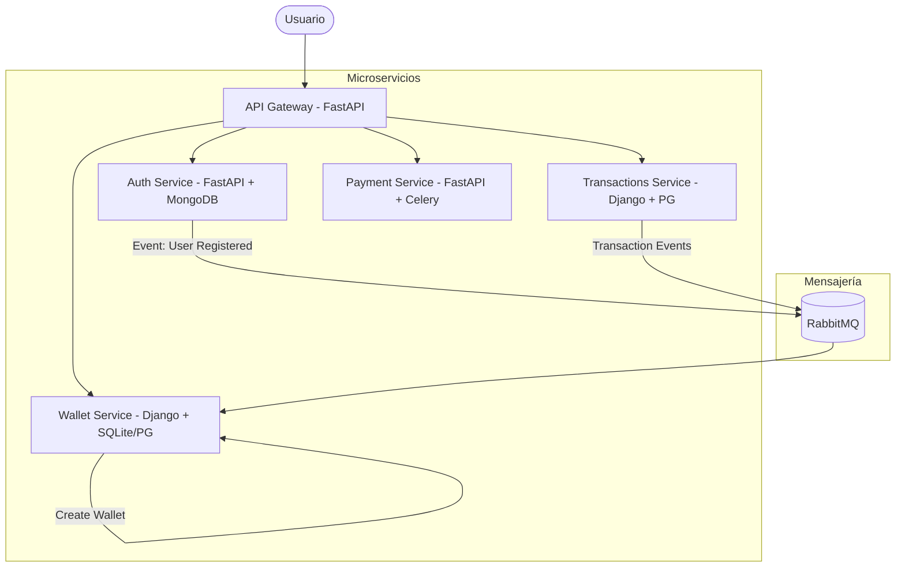

# 🧩 Wallet System — Arquitectura de Microservicios

Proyecto profesional de alto impacto que implementa un sistema de **Billetera Virtual** modular, diseñado con una arquitectura **orientada a eventos** y principios de **resiliencia y alta disponibilidad**.

---

## 🛠️ Tech Stack


---

## 🏗️ Arquitectura del Sistema

El sistema utiliza un **API Gateway** como punto de entrada único, delegando responsabilidades a microservicios especializados que se comunican de forma tanto sincrónica (HTTP/REST) como asincrónica (RabbitMQ).



### 🧠 Patrones de Diseño Implementados
- **API Gateway**: Centralización de autenticación JWT y ruteo.
- **Transactional Outbox**: Asegura que los eventos no se pierdan si el broker falla durante una transacción.
- **Saga Pattern (Coreografía)**: Gestión de consistencia eventual entre los servicios de transacciones y billeteras para completar transferencias.
- **Event-Driven**: Comunicación desacoplada mediante RabbitMQ/Celery.

---

## 🚀 Características Principales
- ✅ **Autenticación Robusta**: JWT con expiración y seguridad bcrypt.
- ✅ **Gestión de Billeteras**: Creación automática al registrarse mediante eventos.
- ✅ **Transferencias Seguras**: Lógica de idempontencia para evitar cobros duplicados y validación de saldo atómica.
- ✅ **Resiliencia**: Manejo de eventos pendientes y reintentos automáticos.

---

## 💻 Cómo ejecutar localmente

### Requisitos
- Docker y Docker Compose
- Poetry (opcional para desarrollo local)

### Pasos
1. Clonar el repositorio.
2. Configurar las variables de entorno (puedes usar `.env.example` en cada servicio).
3. Levantar la infraestructura:
   ```bash
   docker-compose up --build
   ```
4. El sistema estará disponible en `http://localhost:8000`.

---

## 📄 Documentación detallada
- [Arquitectura de Eventos](file:///home/matiasdev/wallet-system/ariquitectura_por_eventos.md)
- [API Gateway](file:///home/matiasdev/wallet-system/api-gateway/README.md)
- [Auth Service](file:///home/matiasdev/wallet-system/auth-service/auth-service.md)
